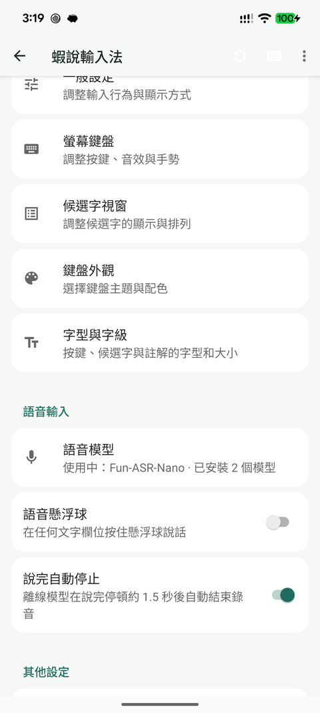
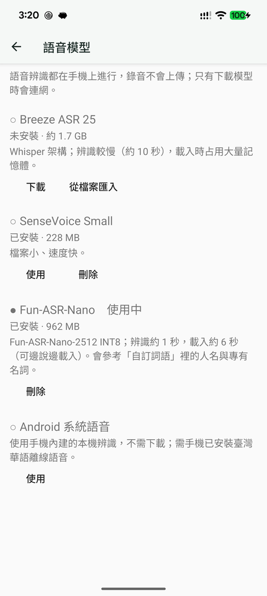
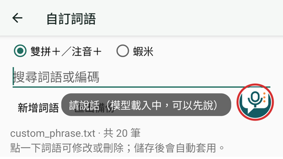
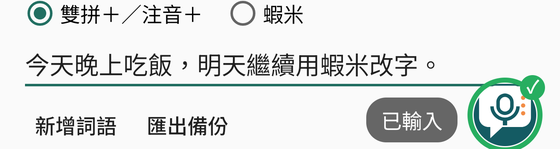

<!--
SPDX-FileCopyrightText: 2026 Rime community

SPDX-License-Identifier: GPL-3.0-or-later
-->

# 蝦說輸入法

以 [Trime（同文輸入法）](https://github.com/osfans/trime) 3.3.12 為基礎的 Android 輸入法，
加上**離線語音輸入**：說完一句話，文字直接寫進目前的文字欄位，鍵盤不切換，接著就能用
Rime 方案（例如嘸蝦米）修字。

[](https://www.gnu.org/licenses/gpl-3.0)

## 功能

- **鍵盤麥克風與語音懸浮球**：在任何文字欄位按住懸浮球 1 秒開始說話，點一下停止，
  拖到畫面中央的 ✕ 關閉。懸浮球使用 App 圖示，待命時半透明；聆聽、等待模型、辨識中、
  完成與錯誤各有不同的外圈與文字提示，TalkBack 會朗讀目前狀態。
  設定首頁「語音輸入 → 語音懸浮球」可隨時開關。
- **辨識都在手機上**：錄音與辨識都在手機上處理，錄音不會上傳；只有下載語音模型時會連網。
- **Gemma 4 E2B 離線文字潤飾**：先選取輸入框中的文字，再按鍵盤工具列「潤」；模型產生結果後會先預覽，按「替換選取文字」才會套用。到設定首頁「AI 文字潤飾 → 下載 Gemma 4 E2B 潤飾模型」即可下載約 2.6 GB 的 LiteRT-LM 模型，下載完成後不必手動搬移檔案。模型下載需要網路，潤飾內容在手機本機處理。
- **可選語音引擎**：
  - Android 系統本機辨識（需手機已安裝臺灣華語離線模型）
  - [sherpa-onnx](https://github.com/k2-fsa/sherpa-onnx) 1.13.8 執行的離線模型：
    Fun-ASR-Nano、SenseVoice Small、Breeze ASR 25
- **語音模型管理**：在設定首頁「語音輸入 → 語音模型」（或鍵盤選單「語音引擎 → 管理模型」）
  下載、選用、刪除模型。下載在背景進行、可中斷續傳；使用行動數據時會先詢問；
  每個檔案都核對大小與 SHA-256 後才安裝。
- **邊錄音邊載入**：按下麥克風立即收音，模型同時在背景載入。
- **說完自動停止**：內建 Silero VAD，說完停頓約 1.5 秒自動結束錄音（設定可關閉），
  辨識前修剪前後靜音。
- **自訂詞語輔助辨識**：Fun-ASR-Nano 以自訂詞語中的人名與術語為熱詞；辨識結果中與自訂詞語
  同音（依 luna_pinyin 讀音，聲調不同時不替換）且已有部分字相同的片段，會改回自訂寫法。
- 離線模型的輸出經 OpenCC `s2twp` 轉為臺灣正體與臺灣用語（例如 视频→影片、内存→記憶體），
  優先使用 rime-tw 的詞典與本地覆寫；「支持」不會被轉成「支援」。另可在「自訂詞語 → 語音用語」
  自訂替換（可跨詞）。
- **字型與字級**：設定首頁「鍵盤與外觀 → 字型與字級」匯入字型，並設定候選字、按鍵、註解等
  各區的字型與大小，約 1 秒套用，不必重新部署。
- **自訂詞語**：設定首頁「輸入資料 → 自訂詞語」可搜尋、新增、修改、刪除
  `custom_phrase.txt`（雙拼＋／注音＋）與 `openxiami_CustomWord.dict.yaml`（蝦米），
  存檔後約 1 秒生效，不必重新部署。編輯只改動詞語那一行，保留檔案原有的註解與格式；
  每次存檔前的版本留在 App 資料夾的 `phrase-backups/`（保留最近 5 份），也可匯出 zip 備份。

## 使用說明

完整的操作說明與截圖見 [doc/USAGE.md](doc/USAGE.md)。

| 設定首頁 | 語音模型 | 語音懸浮球 |
|---|---|---|
|  |  | <br> |

## 語音模型

模型不包含在 APK 裡。在「語音模型」頁按「下載」即可；也可以自行下載後按「從檔案匯入」
（可選多個檔案，或選整個資料夾）。下載來源固定在下列 Hugging Face 版本。

| 模型 | 大小 | 下載 | 備註 |
|---|---|---|---|
| Fun-ASR-Nano INT8 | 約 1 GB | [Hugging Face](https://huggingface.co/csukuangfj/sherpa-onnx-funasr-nano-int8-2025-12-30/tree/main) | 需 `encoder_adaptor`、`llm`、`embedding` 三個 `.int8.onnx` 與 `Qwen3-0.6B/` 內的 `tokenizer.json`、`vocab.json`、`merges.txt` |
| SenseVoice Small INT8 | 約 230 MB | [Hugging Face](https://huggingface.co/csukuangfj/sherpa-onnx-sense-voice-zh-en-ja-ko-yue-2024-07-17/tree/main) | `model.int8.onnx`、`tokens.txt` |
| Breeze ASR 25 | 約 1.7 GB | [Hugging Face](https://huggingface.co/MediaTek-Research/Breeze-ASR-25-onnx-250806/tree/main) | 選檔名含 `half` 與 `int8` 的 encoder、decoder 與 tokens |

Pixel 8 Pro（Tensor G3）上 Fun-ASR-Nano 以 5 個 CPU 執行緒最快，對應 5 顆效能核心；NNAPI 沒有加速。
debug 版的 `VoiceModelBenchmarkActivity` 可用 adb 重測各種執行緒與 provider 組合。

Pixel 8 Pro 實測（單次量測，僅供參考）：Fun-ASR-Nano 載入約 6–7 秒、6–9 秒語音辨識約 1.1–1.3 秒；
Breeze ASR 25 辨識約 9–15 秒。大型模型載入時會占用大量記憶體，系統可能因此關閉背景 App。

## Gemma 文字潤飾模型

Gemma 模型不包含在 APK 中。可在設定首頁「AI 文字潤飾」下載 Gemma 4 E2B（約 2.6 GB）；下載完成後，選取文字並按鍵盤工具列的「潤」即可潤飾。模型由 [LiteRT Community 的 Hugging Face 頁面](https://huggingface.co/litert-community/gemma-4-E2B-it-litert-lm)提供，也可[直接下載 `.litertlm` 模型檔](https://huggingface.co/litert-community/gemma-4-E2B-it-litert-lm/resolve/main/gemma-4-E2B-it.litertlm?download=true)。蝦說會將設定頁下載的檔案放到 App 專用模型資料夾。模型執行及文字潤飾均在手機本機進行。

## 編譯

需要 Java 21、Android SDK 36、NDK 28.0.13004108、CMake 3.31.6。

```sh
git clone --recurse-submodules https://github.com/HuangChengHsien/xiashuo-ime.git
cd xiashuo-ime
BUILD_ABI=arm64-v8a ./gradlew :app:assembleDebug
```

- debug APK 的套件名稱是 `com.osfans.trime.debug`，可和正式版 Trime 並存。
- 編譯過程會讀取 `git config user.name`，未設定時會失敗。
- `app/libs/sherpa-onnx-1.13.8.aar` 由 sherpa-onnx **v1.13.8** 的 Kotlin API 與同版
  [Android 原生函式庫](https://github.com/k2-fsa/sherpa-onnx/releases/tag/v1.13.8) 製成；
  兩者版本不一致時，取得辨識結果會發生 JNI 崩潰。

## 與 Trime 的關係

本專案保留 Trime 至 v3.3.12 的完整歷史，蝦說輸入法的修改都在其後的 commit。
Trime 原本的說明見 [README_trime.md](README_trime.md)。
本專案未包含上游的 GitHub Actions 打包流程。

## 授權

[GPL-3.0-or-later](LICENSE)，與 Trime 相同。第三方元件授權見 `app/licenses/`。
