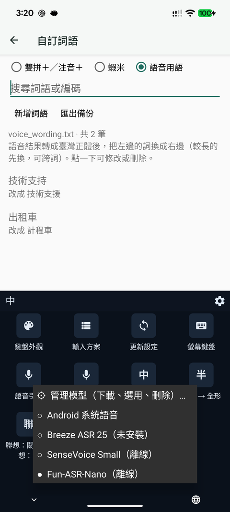
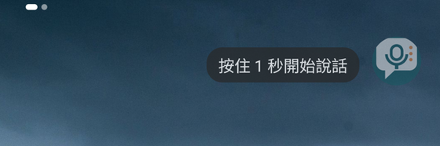
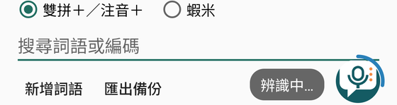
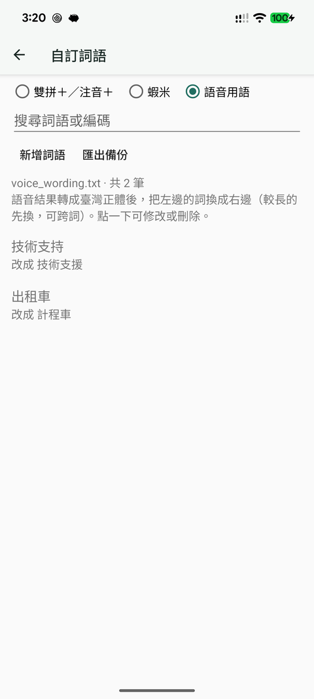
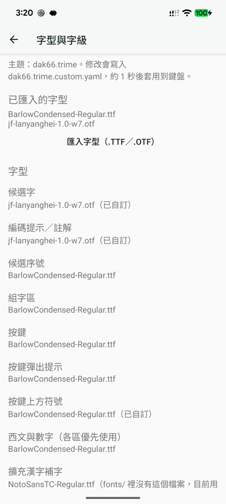
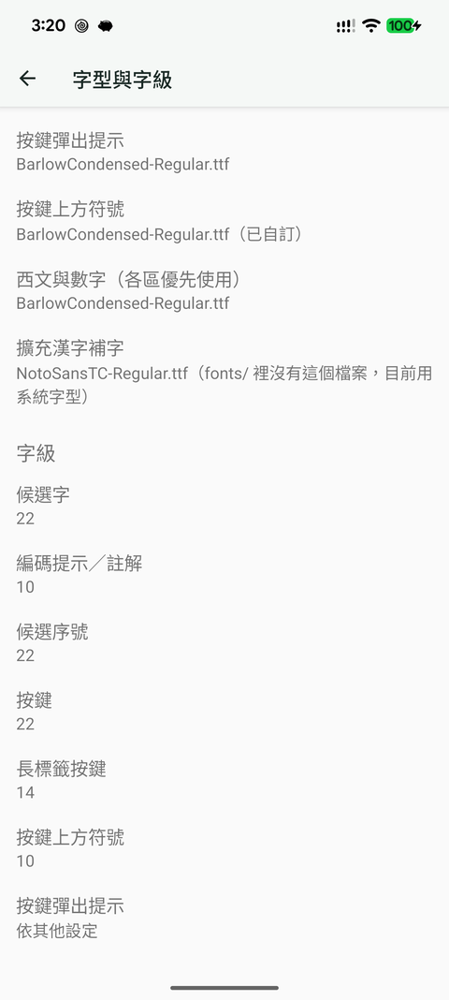

# 蝦說輸入法使用說明

蝦說輸入法以 Trime 為基礎，在一般 Rime 打字之外加上離線語音輸入。以下截圖取自
Pixel 8 Pro。

## 設定首頁

| | |
|---|---|
|  | **鍵盤與外觀 → 字型與字級**：設定按鍵、候選字與註解的字型和大小。  **語音輸入** ・語音模型：下載、選用、刪除離線模型。 ・語音懸浮球：在任何 App 的文字欄位用懸浮球說話。 ・說完自動停止：說完停頓約 1.5 秒自動結束錄音。  **輸入資料 → 自訂詞語**：雙拼＋／注音＋、蝦米的常用詞，以及語音用語修正。 |

## 語音模型

- 每個模型可「下載」「使用」「刪除」，也可「從檔案匯入」自行下載的檔案。
- 下載在背景進行，中斷後會從斷點續傳；使用行動數據時會先詢問。每個檔案都核對大小與
  SHA-256 後才安裝。
- 建議用 **Fun-ASR-Nano**：辨識 4 秒的話約 1.3 秒；模型載入約 6 秒，但會和錄音同時進行，
  按下就可以開始說。它載入時約占 1–1.9 GB 記憶體，系統可能因此關閉背景 App。
- 錄音與辨識都在手機上，錄音不會上傳；只有下載模型時會連網。

## 鍵盤上的語音引擎選單

鍵盤工具列齒輪 → 「語音引擎」可以快速切換引擎；第一項「管理模型」會開啟上面的模型頁。

## 語音懸浮球

在設定首頁開啟「語音懸浮球」後，懸浮球會停在畫面邊緣：

| 狀態 | 畫面 |
|---|---|
| 平常半透明；點一下會提示怎麼用 |  |
| 按住 1 秒開始收音，紅圈隨音量變化；模型還在載入時也可以先說 |  |
| 說完停頓約 1.5 秒自動結束（或點一下停止），藍色弧線表示辨識中 |  |
| 文字直接輸入到目前的欄位，綠色勾表示完成 |  |
| 拖曳時畫面中央出現 ✕，拖到上面放開即關閉 |  |

沒有點選文字欄位時，長按只會顯示提示，不會開麥克風。

## 辨識結果的整理

離線模型輸出簡體字，蝦說會依序：

1. 轉成臺灣正體與臺灣用語，例如 视频→影片、内存→記憶體、阿司匹林→阿斯匹靈；
   「支持」保留不改成「支援」。
2. 套用「語音用語」修正（見下節）。
3. 依讀音把同音字改回「自訂詞語」裡的寫法，例如人名「林雨薇」→「林宇葳」；聲調不同
   （如「晃」與「黃」）或大多數字不同時不會替換。Fun-ASR-Nano 也會把自訂詞語中的人名與
   術語當作提示詞，提高辨識率。

## 自訂詞語與語音用語

「自訂詞語」有三個分頁：

- **雙拼＋／注音＋**（`custom_phrase.txt`）與 **蝦米**（`openxiami_CustomWord.dict.yaml`）：
  打字時的常用詞，存檔後約 1 秒生效，不必重新部署。只會改動你編輯的那一行，檔案原有的
  註解與格式都會保留；每次存檔前的版本會保留在 App 資料夾的 `phrase-backups/`（最近 5 份）。
- **語音用語**：把語音結果中的某個詞換成另一種寫法，可跨詞，例如「技術支持→技術支援」。

「匯出備份」會把三個檔案打包成 zip。

## 字型與字級

| | |
|---|---|
|  |  |

- 「匯入字型」把 `.ttf`／`.otf`／`.ttc` 放進 Rime 使用者目錄的 `fonts/`；同名但內容不同
  的檔案不會被覆蓋。
- 每一區可選「使用主題預設」「系統字型」或已匯入的字型；字級可填 4–80。
- 設定寫入目前主題的 `<主題>.custom.yaml`，只改動對應的 `style/…` 那幾行，約 1 秒後套用
  到鍵盤。主題指定但 `fonts/` 裡沒有的字型會標示「目前用系統字型」。
